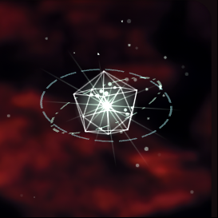

<div align="center">



<h1>Elfie</h1>

<p><b>An AI companion with a persistent memory, a voice, and skills she can write for herself.</b></p>

<p>
  <a href="installer/ElfieSetup.exe">
    
  </a>
</p>

<p>
  
  
  
  
  
  
</p>

</div>

---

Elfie is an AI companion app with a persistent memory, voice conversations, dynamic skills (custom tools the AI can call or teach itself), a desktop overlay daemon for Linux and Windows, and an optional Live2D avatar. The project has a few independent pieces that work together: a web app, a backend API, a desktop daemon, a companion mobile app, and a Live2D overlay.

This project is open for anyone to fork, modify, and build on. There are no restrictions on changing, extending, or repurposing any part of it.

## Highlights

- **Persistent memory** — a knowledge base with vector search, so she remembers across conversations instead of starting cold every time.
- **Voice, two ways** — the classic STT → LLM → TTS pipeline, and Inworld's realtime speech-to-speech for full-duplex calls.
- **Dynamic skills** — custom tools she can call, and write for herself.
- **Desktop overlay** — a floating indicator with global hotkeys and mic capture, on Linux (Wayland layer-shell) and Windows (WebView2).
- **Agent tools** — web search, page fetching, vision, screenshots, a persistent browser profile she drives, and real mouse/keyboard control.
- **Integrations** — Gmail, Calendar, Drive, Telegram, plus scheduled routines and workflows.
- **Image generation** — PixAI for anime/manga, Nano Banana through OpenRouter.

## Project layout

| Folder | What it is |
|---|---|
| `api/` | The backend: Node.js + Express + MongoDB. Handles chat, memory, voice, image generation, integrations, and the dynamic skills system. |
| `elfie-web/` | **The main client** — a web app built with Vite + React. This is where you actually talk to Elfie. |
| `/` (root) | A companion mobile app, built with Expo / React Native. A complement to the web app for using Elfie away from the desktop, not a replacement for it. |
| `daemon/` | A Python background process (Linux and Windows) that shows a floating overlay indicator on the desktop, handles global hotkeys, voice capture, and an optional hand tracking mode for a "mind graph" visualization. |
| `waifu-persona/` | A vendored Godot project (OpenVT) used to render an optional 2D Live2D avatar overlay. It has its own license and README; see `waifu-persona/README.md`. |

You don't need all of these running at once. The API is required for everything else to work; the web app, the daemon and the mobile app are independent clients on top of it.

## Windows: one-click installer

If you're on Windows and just want to run Elfie rather than develop it, skip the
manual steps below and grab
[`installer/ElfieSetup.exe`](installer/ElfieSetup.exe) (2.8 MB). It
installs the API, the web app and the daemon, along with private copies of
Node.js, Python, ffmpeg and MongoDB, and leaves a tray icon that starts and stops
the three of them. Nothing lands on your system `PATH` and no administrator
rights are needed (except one prompt for MongoDB, which you can skip if you
already have a database).

To build that installer yourself, see [`installer/README.md`](installer/README.md) —
it compiles on Linux, in Docker, without Wine or a Windows machine.

## Prerequisites

- Node.js 20 or newer
- npm
- MongoDB (running locally or reachable over the network)
- Python 3.10 or newer (only needed for `daemon/`)
- Godot 4.6 (only needed if you want to build `waifu-persona/` yourself)

## 1. Backend API (`api/`)

```bash
cd api
npm install
cp .env.example .env
```

Fill in `.env` with at least an LLM provider key (OpenRouter is the default; DeepSeek is also supported). Check `.env.example` for the full list of optional keys (voice providers, image generation, search, browser automation).

Make sure MongoDB is running, then start the server:

```bash
npm start
```

By default the API listens on `http://localhost:3000`.

## 2. Web app (`elfie-web/`)

```bash
cd elfie-web
npm install
cp .env.example .env
npm run dev
```

`VITE_API_URL` in `.env` should point at your running API (defaults to `http://localhost:3000`).

## 3. Companion mobile app (root)

```bash
npm install
cp .env.example .env
npx expo start
```

`EXPO_PUBLIC_API_URL` in `.env` should point at your running API. If you're testing on a physical device over Wi-Fi, use your machine's LAN IP instead of `localhost`, since the phone can't resolve `localhost` as your computer.

Run on a connected Android device or emulator with:

```bash
npm run android
```

## 4. Desktop daemon (`daemon/`)

The daemon shows a floating overlay avatar, listens for a mute/unmute hotkey, and streams your microphone to the API for voice conversations. It runs on **Linux** (best on Wayland compositors with layer-shell support — Hyprland, Sway and similar) and on **Windows 10/11**. Everything OS-specific lives in `daemon/platform_compat.py`; run it directly to see what the daemon detected on your machine:

```bash
python3 daemon/platform_compat.py
```

### Linux

System dependencies (package names below are for Arch Linux; adjust for your distro):

```bash
sudo pacman -S python-gobject gtk3 gtk-layer-shell webkit2gtk-4.1 ffmpeg mpg123 xdotool grim
```

- `ffmpeg` and `mpg123` handle microphone capture and audio playback.
- `xdotool` and `grim` are used by the AI's computer control tools (mouse, keyboard, screenshots).
- Your user needs to be in the `input` group for the global mute hotkey to work; the install script below handles that.

Install:

```bash
cd daemon
pip3 install -r requirements.txt --break-system-packages
./install.sh
```

This installs an `elfie-daemon` and `elfie` command into `~/.local/bin`. Log out and back in once (so the `input` group membership takes effect), then:

```bash
elfie-daemon &
elfie switch <chatId>
```

The daemon reads its config from `~/.config/elfie/daemon.json`, including which API URL to talk to (defaults to `http://localhost:3000`).

### Optional: hand tracking

The "show me your mind" feature can respond to hand gestures via webcam. It's an optional, separate install that keeps its heavier dependencies (mediapipe, opencv) out of the main daemon environment:

```bash
cd daemon
./setup_hand_tracking.sh
```

### Windows

Install [ffmpeg](https://www.gyan.dev/ffmpeg/builds/) and make sure `ffmpeg.exe` and `ffplay.exe` are on your `PATH` (`ffmpeg -version` in a new terminal should work). Then:

```powershell
cd daemon
pip install -r requirements.txt
python elfie_daemon.py
```

`pip` picks the right extras per platform: `evdev` is skipped, and `pywebview[edgechromium]` is installed for the overlay. WebView2 ships with Windows 11 and current Windows 10; if the overlay stays blank, install the [Evergreen runtime](https://developer.microsoft.com/microsoft-edge/webview2/).

Config lives in `%APPDATA%\elfie\daemon.json` (same JSON as the Linux one).

What differs from Linux, and why:

| | Linux | Windows |
|---|---|---|
| API ↔ daemon IPC | unix socket `/tmp/elfie.sock` | TCP on `127.0.0.1`, port published to `%TEMP%\elfie\elfie.port` |
| Global hotkeys | `evdev` (needs the `input` group) | `RegisterHotKey` via ctypes, no extra dependency and no group setup |
| Overlay | GTK + GtkLayerShell + WebKit2 | WebView2 through pywebview, rendering the same HTML files |
| Echo cancellation | PipeWire `elfie_mic_aec` / `elfie_speaker_aec` | none available — software mute gate only, **use headphones** |
| Mic capture | `-f pulse` | `-f dshow` |
| "Selected text" | X11/Wayland primary selection | the normal clipboard (Windows has no primary selection) |

Two knobs, both optional:

- `ELFIE_MIC_DEVICE` — pin a specific microphone. List them with `ffmpeg -list_devices true -f dshow -i dummy`; otherwise the first audio device found is used.
- `ELFIE_DAEMON_PORT` / `ELFIE_DAEMON_ADDR` — override the IPC port (daemon side / API side).

Known gaps on Windows: the overlay renders on the primary monitor only (the Linux one opens a window per monitor), and the computer-control tools still shell out to `xdotool`/`grim`, which have no Windows equivalent wired up yet.

## 5. Live2D avatar (`waifu-persona/`)

This is a vendored copy of OpenVT, a separate open source 2D VTubing project, used here to render an optional avatar. It's a Godot 4.6 project; open the `waifu-persona/` folder in Godot to build it. See `waifu-persona/README.md` for details specific to that project.

## Contributing

Pull requests, forks, and modifications of any kind are welcome. There's no formal contribution process; open an issue or a PR.
